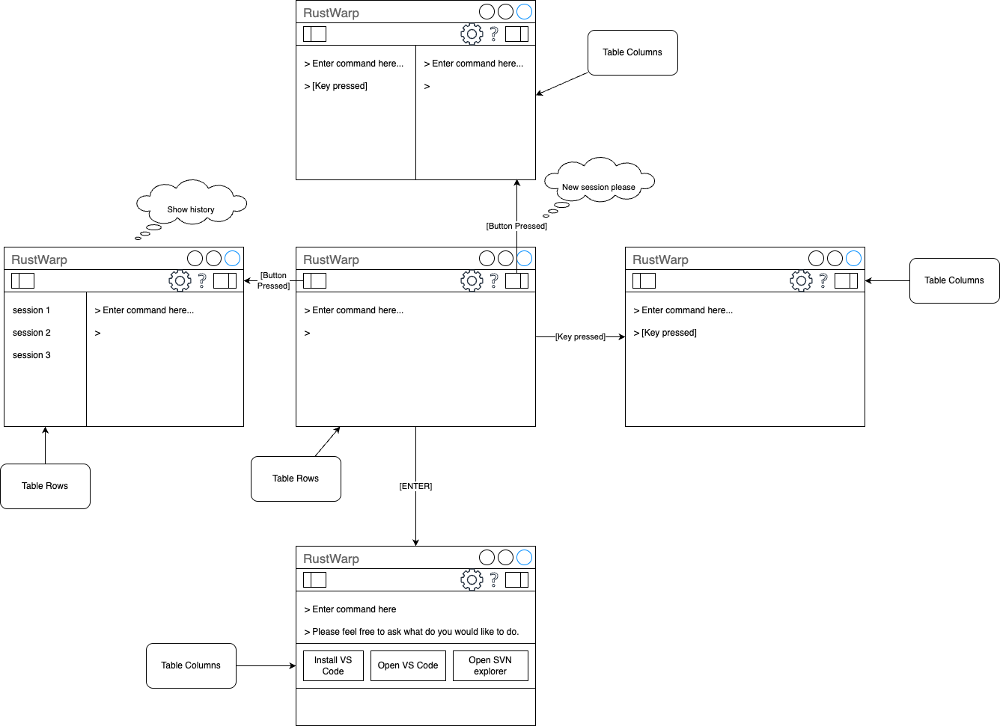

# RustWarp with Tauri

Prompt terminal with effortless for your office.

## History

| Version | Build  | Detail        | Author    |
| ------- | ------ | :------------ | --------- |
| 0.01    | 250627 | Newly created | Naphat J. |

## License

MIT

## Feature

- Ask
  - Azure Playground
  - Google
- Get
  - File
    - Network drive
    - SCM
    - Git
    - SVN
- Session
  - Sticky
  - Auth
    - OAuth
    - LDAP
- Configuration
  - Import
  - Export
- Deploy
  - CICD
    - Startup
    - Request
    - Retrieve
- Installation
  - Download
  - Install
- Launch
  - GUI(outside)
  - CLI(inside)

## Design

[Open the draw.io file](design.drawio)
